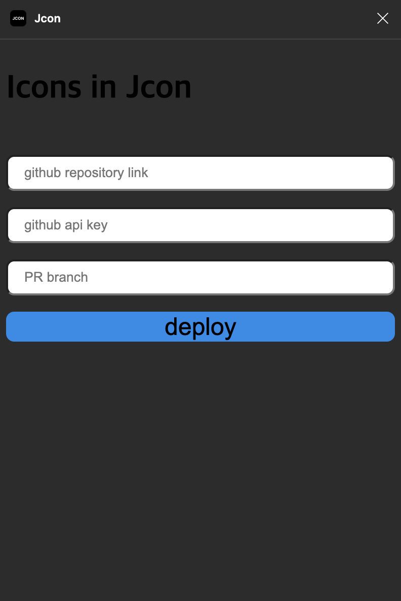

## Jcon

[Jcon plugin 보러가기](https://www.figma.com/community/plugin/1309062649368251278)

단순하게 플러그인 이름을 `Jcon`이라고 짓게되었습니다.
`Icon`의 내용을 `JSON`으로 변환을 하는 과정이었기에 `JSON + Icon`을 하여서 `Jcon`이 되었습니다

## React에서 Icon을 사용하는 방법

`Icon`을 다들 어떻게 사용하고 계신가요??<br/>
매번 `svg`를 `import`하여 사용하거나 컴포넌트를 사용하고 계시진 않으신가요?<br/>
저는 매번 디자이너 분이 아이콘을 만들어주시고 페이지를 제작할 때 필요한 아이콘이 있다면
피그마를 참고하여 해당 아이콘 컴포넌트를 제작하여 사용하였습니다.

<Callout title='개선할 수 있는 방법이 있을까...?' variant='warn'>

매번 추가 될 때마다 컴포넌트를 만들기엔 너무 손도 많이가고 무수히 많아진다면 힘들어질텐데...

</Callout>

방법을 찾기 위해서 인터넷을 돌아다녔습니다. 이미 해당 상황을 마주한 사람들은 많을 테고 해결책을 있을테니까요
[Socar에서 Icon components 개발기](https://tech.socarcorp.kr/dev/2022/09/06/react-icon-component.html)와, 당근에서 만든 플러그인 [Icona](https://junghyeonsu.com/posts/quickly-apply-icons-that-exist-in-figma-to-your-dev-team/)를 알게 되었습니다.
제가 필요했던 기능들을 다 제공하고 있지만 제가 필요한 부분의 값을 얻지 못해서 직접 만들어 보기로 하였습니다.

<Callout >

당근마켓을 다니는 정현수님 블로그 많은 도움이 되었습니다 이 글을 빌어 감사인사드립니다!! :)

</Callout>

## 필요한 기능

저에게 필요한 기능은 다음과 같았습니다.

1. figma에서 업로드를 히여 github으로 적용할 수 있어야할 것
2. 크기를 조절 할 수 있어야한다
3. 하나의 컴포넌트에서 모든 아이콘을 관리할 수 있어야한다

## 개발 진행

먼저 `Icon` 컴포넌트의 경우 `svg`태그의 기능을 넣어 두었고 아이콘을 그리기 위해 `svg`값들이 필요했습니다.<br/>
그리고 아이콘의 크기 조절도 할 수 있도록 `width,height`값을 변경 가능하도록 하고 color 값을 통해 `path`값들의 색상을 변경할 수 있도록 하였습니다.

### svg 값 통일화

`svg`값에는 많은 값들이 있었습니다 `rect,circle`등 각 값들마다 필요한 값이 있어 통합을 했어야 했습니다.
쏘카에서는 해당 작업을 path값으로 변환해주는 기능을 도입하여 해결을 하였습니다. 하지만 저는 디자이너분 께서 Icon을 제작할 때 `path`값으로만 작업할 수 있다는 배경을 두고 작업을 진행하였습니다.
변환하는 로직을 추가해도 좋지만 추가작업이 생기고 저는 빠르게 제작하여 사용을 해야했기에 넘기었습니다.

figma에서 플러그인을 통해서 바로 Icon들의 이름과 `path` `d` 값을 구하여 `JSON`파일을 만들고 이를 해당 깃허브에 PR을 올리는 형식으로 개발을 하였습니다.

### 배포할 아이콘 정하기

figma에서 `Jcon`이라는 프레임안에 아이콘이 존재해야만 가능하도록 하였습니다. 아직 개발중인 아이콘이 있을 수도 있고 배포를 원하는 아이콘을 특정하기 위해서 프레임안에 있도록 정하였습니다.

### 적용 후 달라진 점

기존에는 다음과 같이 아이콘 하나 당 컴포넌트를 제작하였습니다

```jsx
const LeftCheron = () => {
  return (
    <svg>
      <path d='****'></path>
    </svg>
  );
};

//적용 컴포넌트
<LeftCheron />;
```

변경 후에는 아이콘마다 컴포넌트를 생성하지 않고, `Icon`이라는 하나의 컴포넌트에서 관리를 가능하게 되었습니다.

```jsx
const Icon = ({ icon, width, height, color }) => {
  return (
    <svg width={width} height={height} stroke={color}>
      <path d={icons[icon].svg}></path>
    </svg>
  );
};

//적용 컴포넌트

<Icon icon='leftCheron' width='24px' height='24px' color='black' />;
```

### PR 요청 진행하기

figma에서 바로 Github으로 PR을 날리기 위해 다음 정보를 받아야 했습니다,

1. Repository link
2. Api사용을 위한 Token값
3. PR을 받을 branch명

아이콘을 `Jcon` 프레임에 정의해두고 `Deploy`를 하게 되면 브랜치를 생성하고 커밋후에 PR요청이 가도록 하였습니다.<br/>
기존에 `Merge`를 하지않고 다시 진행을 했을 때는 기존의 `Branch`를 삭제 후 다시 만들어 PR을 요청하니 이전 내용을 알아야한다면 **조심해야합니다!**



> 디자인적인 부분은 신경을 잘 쓰지않아서 투박합니다 ㅎㅎ

## 피그마 플러그인 배포하기

저와 같이 d 값만을 필요한 사람도 있을 것 같아 피그마 플러그인에 배포를 요청했습니다.
신청 후에 며칠 안 돼서 콘텐츠 팀이 리뷰하여 배포를 승인했다는 메일이 왔습니다.

[Jcon plugin 보러가기](https://www.figma.com/community/plugin/1309062649368251278)

어디에 제작했다고 공개를 하지 않았는데 배포를 진행 후에 **일주일**도 안되어서 사용한 사람들이 70명을 넘어갔다는 메일을 받게 되었습니다.
**많은 분들이 사용하시니 도움이 된 거 같아서 기분이 좋네요 ㅎㅎ**<br/>


<Callout variant='primary'>
  필요하시다면 많은 이용 부탁드리고, 피드백이나 불편한 점 있으시다면 메세지 남겨주세요!
</Callout>
