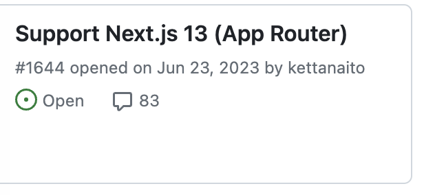

## 다들 겪어본 문제 상황

프론트엔드를 개발 하면서 겪는 불편한 점들이 있어요<br/>
그 중에 하나가 개발 프로세스중 개발과정이 겹친다는 것이죠<br/>
기획, 디자인, 백엔드가 완료되고 전달받은 자료로 편안하게 개발할 수 있을 것 같지만 현실은 그렇게 호락호락하지 않았습니다.
현실은 병행하여 진행을 해야합니다.<br/>
마감기한은 있고 개발,테스트,디버깅 등 해야할 일은 많고 백엔드 api가 아직 없는 상황이라고 그냥 손을 놓고있을 수는 없잖아요?
그래서 **MSW**을 통해서 실제 API들을 모킹해서 개발 환경을 개선하고 개발을 진행할 수 있습니다

## MSW란?

MSW(Mock Service Worker)로 **브라우저** 및 **Node.js**용 API 모의 라이브러리입니다. MSW를 이용해서 http요청들을 가로채서 관찰하고 응답을 할 수 있어요

실제 **백엔드 서버 없이**도 API 요청과 응답을 시뮬레이션 할 수 있어서 프론트엔드 개발과 테스트 과정을 간소화하고 가속화 할 수 있어요

> 응답이라면 Next.js로 api를 만들면 되지않을까?

응답을 보내 준다고만 생각이들어 그냥 nextjs api를 만들어서 response값만 넘겨주는것과 동일해 보였어요.
무엇이 다른지 살펴보도록 해볼게요

### MSW

MSW는 서버없이 HTTP요청을 가로채고 **모킹된 응답**을 반환할 때 사용이 됩니다. 실제 구현을 기다리지 않고 API호출을 시뮬레이션을 할 수 있어요

MSW는 **브라우저 레벨**에서 네트워크 요청을 가로채는 **서비스워커**를 사용하기 때문에 실제 네트워크 요청이 발생하기 전에 **가로채어** 모킹된 응답을 제공할 수 있어요

장점으로는 프레임워크에 **종속되지않고** 다양한 네트워크 시나리오(성공, 실패, 지연 등)을 쉽게 시뮬레이션 할 수 있는 장점이 있어요

### Route Handler

Next.js Route Handler는 Next.js 애플리케이션 내에서 **API엔드 포인트**를 쉽게 구현할 수 있습니다. 이를 통해서 **서버사이드 로직**을 실행하고, 데이터베이스 쿼리, REST API호출 등 백엔드 기능을 구현할 수 있어요

동작방식은 Next.js 서버에서 실행되는 **서버사이드 코드**입니다. 클라이언트로부터 들어오는 요청을 처리하고 응답을 반환해요

장점으로는 프론트엔드와 백엔드를 동일한 프로젝트 내에서 관리할 수 있으며, API 요청 처리 로직을 쉽게 구현하고 배포할 수 있어요

## 무엇을 선택해야할까요?

Route Handlers를 선택하지 말아야하는 이유로는 직접 api를 만들어 사용하게 되면 이후에는 api요청 주소를 다 변경해주어야하고, 개발했던 코드들도 삭제를 해주어야해요.
빌드시에 포함되어 빌드가 되기 때문에 빌드의 크기가 커지는 이유도있어요.<br/>
실제 백엔드 로직을 원하는건 아니고 **API 호출**의 모킹과 **테스팅**이 주 목적이기 때문에 MSW를 사용하는것이 좋지 않을까 생각해요🧐

## MSW 적용해보기

### 설치

우선 MSW를 설치해보도록 할게요

```bash
npm install msw --save-dev
```

서비스 워커를 등록하기 위해서는 스크립트를 호스팅하고 제공하여야하기 때문에<br/>
`public`폴더 위치에 서비스 워커를 등록해주세요

```bash
npx msw init ./public --save
```

### MSW 셋팅

`src/mocks/` 해당 경로에 필요한 파일들을 만들어 줄게요.

> src를 사용하지 않으신다면 바로 mocks폴더를 만들어 진행하셔도 무방합니다.

next.js 서버 환경에서도 대응을 해야하기 때문에 서버와 클라이언트 상황에 대해서 대응을 해주어야 하는데요. msw에서는 `browser`와 `node.js`환경을 지원하기 때문에 쉽게 가능해요.

먼저 응답을 해줄 **handlers**를 만들어 줄게요.

응답은 `REST API`, `GraphQL API` 방식이 가능해요. 이 글에서는 `REST API` 로 해볼게요.

**handlers.ts**

```tsx
import { HttpResponse, http } from 'msw';

export const handlers = [
  http.get('https://api.example.com/api/user', () => {
    return HttpResponse.json({
      data: {
        name: 'handongryong',
        age: 25,
      },
    });
  }),
];
```

http요청을 msw의 http으로 가로챌 수 있어요<br/>
설정한 경로의 문자열과 일치한 요청만 차단이 됩니다.<br/>
필요한 http 모킹해야할 경로들을 추가해주고 리턴값을 넣으면 됩니다.

return 응답객체의 경우에는 fetch API에 있는 Response 클래스를 통해서 응답을 보내도 되지만 msw에서 제공하는 `HttpResponse` 를 사용하는것을 **추천합니다**.

<Callout variant='primary'>

native보다 간결하게 response같은 응답을 선언하는데 유용한 단축 메서드를 캡슐화하여 사용 가능합니다.

</Callout>
<Callout variant='primary'>

native와는 달리 모킹값에 헤더를 설정하고 쿠키를 설정할 수 도있습니다.

</Callout>

이번엔 worker 두개를 설정해줄게요.

**browser.ts**

```tsx
import { setupWorker } from 'msw/browser';
import { handlers } from './handlers';

export const worker = setupWorker(...handlers);
```

**server.ts**

```tsx
import { setupServer } from 'msw/node';
import { handlers } from './handlers';

export const server = setupServer(...handlers);
```

**index.ts**

```tsx
export async function initMsw() {
  if (typeof window === 'undefined') {
    const { server } = await import('../mocks/server');
    server.listen();
  } else {
    const { worker } = await import('../mocks/browser');
    await worker.start();
  }
}
```

서버일 때는 server를 클라이언트일때는 worker를 실행 시켜주도록 할게요

실행 시켜주기 위한 컴포넌트를 생성해볼께요

```tsx
'use client';

import { useEffect, useState } from 'react';

export const MSWComponent = ({ children }: { children: React.ReactNode }) => {
  const [mswReady, setMswReady] = useState(false);
  useEffect(() => {
    const init = async () => {
      const initMsw = await import('./index').then((res) => res.initMsw);
      await initMsw();
      setMswReady(true);
    };

    if (!mswReady) {
      init();
    }
  }, [mswReady]);

  return <>{children}</>;
};
```

해당 컴포넌트를 `app/layout.tsx` 에 감싸주세요

```tsx
<body>
  <MSWComponent>{children}</MSWComponent>
</body>
```

그리고 실행을 하게 되면 콘솔에


메세지가 뜬다면 성공적으로 MSW를 적용이 된겁니다!!

fetch요청을 handlers에 정의한 주소로 보내보면 응답이 오는걸 볼 수 있어요


## 이렇게 쉽게 적용이 되나요?

저는 next.js 14버전 app router였고 RSC환경도 존재했습니다.

RSC환경에서는 정상적으로 동작을 하지 않았고 `fetch failed` 라는 에러를 마주하게 됩니다.

msw github에 들어가 issue를 살펴보니



가장 상단에 저와 같은 이슈가 있었습니다.

[이슈보러가기](https://github.com/mswjs/msw/issues/1644)

해결방법으로는 `@mswjs/http-middleware` 와 `express` 로 모의 서버를 구현하여 제공하는 방법이였고

또 다른 방법으로는 3주전에 올라온 next.js의 instrumentation을 이용한 방법이였습니다. 목업 서버를 만들기보다 해당 방법을 사용해보기로 하였습니다. (이 방법은 모든 분들에게 추천하기 어렵다고 합니다.)

instrumentation 기능은 next.js에서 [제공하는 기능](https://nextjs.org/docs/app/building-your-application/optimizing/instrumentation)입니다. next.js의 서버 인스턴스가 시작될 때 **한 번** 호출됩니다.

`instumentation.ts`는 app과 동일한 위치에 존재해야합니다 src폴더가 있다면 내부에 바로 생성하면 됩니다.

```tsx
export async function register() {
  if (process.env.NEXT_RUNTIME === 'nodejs') {
    const { server } = await import('./mocks/server');
    server.listen();
  }
}
```

`instumentation.ts` 에 해당 코드를 넣고

이제 `next.config` 파일로 가봅니다

먼저 `instrumentation` 을 활성화 하기 위해

```
experimental: {
    instrumentationHook: true,
  },
```

해당 옵션을 추가해준뒤

```jsx
webpack(config, { isServer }) {
    if (isServer) {
      if (Array.isArray(config.resolve.alias)) {
        config.resolve.alias.push({ name: "msw/browser", alias: false });
      } else {
        config.resolve.alias["msw/browser"] = false;
      }
    } else {
      if (Array.isArray(config.resolve.alias)) {
        config.resolve.alias.push({ name: "msw/node", alias: false });
      } else {
        config.resolve.alias["msw/node"] = false;
      }
    }

    return config;
  },
```

webpack 설정을 추가해주면 RSC환경에서도 동작은 할 수 있습니다.

RSC에서 fetch를 해보고 Log를 작성해보면 터미널에 정상적으로 데이터가 넘어오는걸 볼 수 있습니다


현재 상황에서 handlers에서 리턴값을 변경해도 실시간으로 반영은 되지 않았습니다.

브라우저 개발자 도구에서 application에 service worker를 unregister를 하고 새로고침을 해도 똑같았습니다.

결국 새로운 값을 적용하기 위해서는 **개발 서버를 재시작**하는 방법밖에 없는 것 같아요.😭
툴을통해 실시간으로 응답값을 변경하여 테스트를 진행하는 방법은 어려워 보이네요.
추후에 지원이 될 수 있지않을까 기대해봅니다.

<Callout variant='primary'>

이번에는 적용방법과 MSW에 대해서 알아보았는데<br/>
다음번에 좀 더 사용하기 좋은 방법으로 다시 찾아오겠습니다

</Callout>
