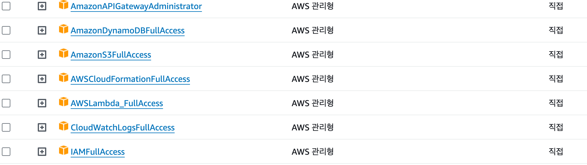
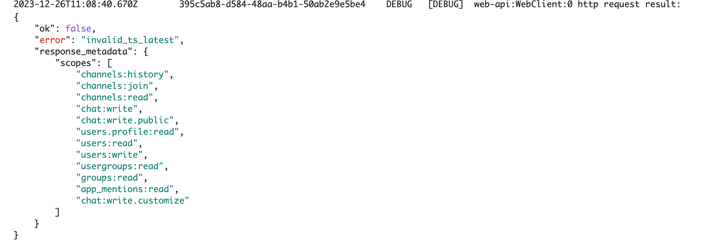

<Callout variant='warn'>

개발의 모든 부분을 설명하지 않습니다

</Callout>

## 개발 계기

현재 다니고 있는 회사에서 휴가 관리를 Flex 서비스를 통해서 관리를 하고 있습니다.

휴가를 요청하고 승인이 되면 Slack 채널에 당사자의 이름과 휴가 일정이 메세지로 전송이 됩니다. 하지만 이건 승인이 되었을 때 메세지가 전송이 되어서 휴가 당일인지 알 수 없습니다.
그래서 동료분을 찾다가 “맞다 오늘 휴가신가?” 라는 생각이 들 때가 있습니다.

휴가자의 휴가 당일과 그 전날에 알림이 왔으면 좋겠다라고 팀원이 요청을 했습니다.
그렇게 오래 걸리진 않겠다고 생각이 되어 바로 개발에 들어갔습니다.

## 필요 기능과 기술 찾기

먼저 슬랙페이지를 접속해 보았습니다. 많은 봇들이 있었고 쉽게 슬랙 봇을 제작할 수 있는 [Bolt](https://slack.dev/bolt-js/concepts)라는 도구가 있었습니다 다행히 JS를 지원해서 해당 도구를 통해서 개발을 하기로 하였습니다.

Flex에서 보내는 메세지를 휴가 일정에 보내지도록 등록해야합니다. Slack에서 제공하는 예약 메세지를 이용하여 메세지를 등록하기로 하였습니다. 하지만 예약 메세지는 수정이 불가능 해서 메세지를 삭제 후 재등록 해야했습니다. 그래서 메세지를 관리하는 스토어가 필요할 것 같습니다

## 개발 시작

### 이름 작명하기

휴가에 대해서 알림을 주는 봇이고 평범한 이름 말고 **스토리**를 넣어 재미있게 만들고 싶었습니다.

휴가를 가지못해 원한이 남은 유령이 휴가자들을 찾아 부러움에 알리고 다니는 유령이다 라는 봇의 스토리를 만들었고 해당 봇의 이름은 **휴가 유령**이라고 명명하였습니다.

휴가유령이니까 메세지는 어떻게 보내면 좋을까 고민하다가 다음과 같이 정하였습니다.

공통적인 알림 메세지의 제목은 “**휴가 유령이 찾아왔어요**!!”라고 하였습니다.
이전날의 메세지의 제목은 무슨 일이 벌어질 것 같은 분위기 연출을 위해

<Callout variant='primary' title='이전 날 제목'>

“내일 무슨일이 일어날 것 같은 으스스한 느낌이 옵니다”

</Callout>
<Callout variant='primary' title='이전 날 제목'>

“오늘 휴가자들이 나타났어요!!”

</Callout>

### 셋팅하기

[Bolt](https://slack.dev/bolt-js/tutorial/getting-started) 문서가 잘 되어있어 보고 쉽게 따라할 수 있습니다.

<Callout variant='primary' title='Tip'>

디버그를 위해서 Bolt App생성시에 옵션으로 logLevel: LogLevel.DEBUG 넣으면 자세히 볼 수 있습니다.

</Callout>

저는 Flex에서 보내는 알림을 트리거해야하기 때문에 `Event`기반으로 동작하도록 하였습니다. Slack에 생성한 APP에 가보시면 `Event Subscriptions`가 있습니다.

이 것을 활성화 시켜주고 그러면 원하는 이벤트 발생시 설정한 URL로 POST request를 보낼 수 있습니다.


저는 채널에 메세지가 오는것을 알기위해 `message.channels`를 추가 하였습니다.

### 메세지 등록하기

먼저 Flex가 보내는 메세지일 때 동작해야하기 때문에 Flex가 보냈을 때 정보를 파악하고 Flex bot의 고유의 ID값을 찾아서 해당 ID값을 가진 유저의 메세지가 아니라면 동작하지 않도록 하였습니다.

Flex에서 보내주는 메세지는 여러개의 메세지가 존재합니다. 왜냐하면 하루종일 휴가 이거나 반차 등 다양한 변수가 있었습니다.

하지만 메세지에는 동일한 부분이 있었는데 바로 이름과 휴가 일자였습니다.

동일한 구조로 메세지가 오고 뒷 부분만 변경이 되는 형식이여서 메세지를 가져오고 정규식을 통해 이름값과 일자 값을 가져왔습니다.

Date로 일자를 계산하여 이전날과 당일날 오전 8시로 맞추어 놓았습니다.

그리고 스토어에 `Date.getTime()`을 하여 스토어에 메세지와 저장하였습니다. Slack API를 통해 메세지를 예약해 줍니다.

```jsx
const result = await app.client.chat.scheduleMessage({
  channel: channelId,
  text: 'Looking towards the future',
  // Time to post message, in Unix Epoch timestamp format
  post_at: CurrentDate.getTime() / 1000,
});
```

Bolt app에 이벤트 부분에 들어오는 인자값인 `context`와 `payload`를 살펴보면

메세지가 온 채널 정보와 셋팅할 때 발급받은 `Token`값이 있어 활용하면 됩니다.

예약 메세지에 대한 API정보는 다음 링크에 잘 나와있습니다

[예약 메세지 API 보러가기](https://api.slack.com/messaging/scheduling)

### 테스트 하기

처음엔 [글리치](https://glitch.com/)라는 서비스를 통해 배포를 하였습니다

`Slack Event Subscription`에 URL을 설정해주었습니다

테스트를 진행해 보았는데 문제가 생기었습니다.

<Callout variant='warn'>

무료 버전 글리치는 몇 분이상 요청이없으면 꺼지게 되어 요청을 받지 못한다 (Lambda 처럼 동작하는지 정확히는 모르겠다...)

</Callout>
<Callout variant='warn'>

종료가 되다보니 Class instance로 스토어를 작업하던 데이터가 날아간다

</Callout>
<Callout variant='warn'>

휴가를 정정 혹은 취소할 수 없다.

</Callout>
<Callout variant='warn'>

휴가를 정정 혹은 취소할 수 있습니다.

</Callout>

<Callout variant='warn'>

메세지가 한국시간으로 발송되지 않는다.

</Callout>

**해결책**

<Callout variant='primary'>

AWS Lambda를 통해 배포를 진행한다.

</Callout>
<Callout variant='primary'>

AWS DynamoDB를 이용하여 데이터를 저장한다.

</Callout>
<Callout variant='primary'>

취소 기능을 추가한다

</Callout>
<Callout variant='primary'>

한국시간을 위해 9시간을 빼주고 예약한다

</Callout>

회사에서 AWS를 사용하고 있었기 때문에 AWS를 이용하기로 했습니다

## 리팩토링

`AWS Lambda`로 배포를 하기 위해 `Serverless`라는 프레임워크를 사용하기로 했습니다.

그래서 일자를 계산하는 로직에 **한국시간**으로 설정해주어야 하기 때문에 -9시간 해주었습니다.

취소시 메세지를 보니 등록되었을 때와 구조가 같고 뒤에 “취소 되었습니다” 라는 문구가 추가되는 것을 보고 “취소” 라는 단어가 들어간다면 취소 로직을 실행시키도록 하였습니다.

### Slack Message 구조

하나의 메세지에서 제목과 여러개의 값을 넣어야하기 때문에 Slack에서 제공하는 [Block Kit](https://app.slack.com/block-kit-builder/T023K8JGZRP#%7B%22blocks%22:%5B%7B%22type%22:%22section%22,%22text%22:%7B%22type%22:%22mrkdwn%22,%22text%22:%22Hello,%20Assistant%20to%20the%20Regional%20Manager%20Dwight!%20*Michael%20Scott*%20wants%20to%20know%20where%20you'd%20like%20to%20take%20the%20Paper%20Company%20investors%20to%20dinner%20tonight.%5Cn%5Cn%20*Please%20select%20a%20restaurant:*%22%7D%7D,%7B%22type%22:%22divider%22%7D,%7B%22type%22:%22section%22,%22text%22:%7B%22type%22:%22mrkdwn%22,%22text%22:%22*Farmhouse%20Thai%20Cuisine*%5Cn:star::star::star::star:%201528%20reviews%5Cn%20They%20do%20have%20some%20vegan%20options,%20like%20the%20roti%20and%20curry,%20plus%20they%20have%20a%20ton%20of%20salad%20stuff%20and%20noodles%20can%20be%20ordered%20without%20meat!!%20They%20have%20something%20for%20everyone%20here%22%7D,%22accessory%22:%7B%22type%22:%22image%22,%22image_url%22:%22https://s3-media3.fl.yelpcdn.com/bphoto/c7ed05m9lC2EmA3Aruue7A/o.jpg%22,%22alt_text%22:%22alt%20text%20for%20image%22%7D%7D,%7B%22type%22:%22section%22,%22text%22:%7B%22type%22:%22mrkdwn%22,%22text%22:%22*Kin%20Khao*%5Cn:star::star::star::star:%201638%20reviews%5Cn%20The%20sticky%20rice%20also%20goes%20wonderfully%20with%20the%20caramelized%20pork%20belly,%20which%20is%20absolutely%20melt-in-your-mouth%20and%20so%20soft.%22%7D,%22accessory%22:%7B%22type%22:%22image%22,%22image_url%22:%22https://s3-media2.fl.yelpcdn.com/bphoto/korel-1YjNtFtJlMTaC26A/o.jpg%22,%22alt_text%22:%22alt%20text%20for%20image%22%7D%7D,%7B%22type%22:%22section%22,%22text%22:%7B%22type%22:%22mrkdwn%22,%22text%22:%22*Ler%20Ros*%5Cn:star::star::star::star:%202082%20reviews%5Cn%20I%20would%20really%20recommend%20the%20%20Yum%20Koh%20Moo%20Yang%20-%20Spicy%20lime%20dressing%20and%20roasted%20quick%20marinated%20pork%20shoulder,%20basil%20leaves,%20chili%20&%20rice%20powder.%22%7D,%22accessory%22:%7B%22type%22:%22image%22,%22image_url%22:%22https://s3-media2.fl.yelpcdn.com/bphoto/DawwNigKJ2ckPeDeDM7jAg/o.jpg%22,%22alt_text%22:%22alt%20text%20for%20image%22%7D%7D,%7B%22type%22:%22divider%22%7D,%7B%22type%22:%22actions%22,%22elements%22:%5B%7B%22type%22:%22button%22,%22text%22:%7B%22type%22:%22plain_text%22,%22text%22:%22Farmhouse%22,%22emoji%22:true%7D,%22value%22:%22click_me_123%22%7D,%7B%22type%22:%22button%22,%22text%22:%7B%22type%22:%22plain_text%22,%22text%22:%22Kin%20Khao%22,%22emoji%22:true%7D,%22value%22:%22click_me_123%22,%22url%22:%22https://google.com%22%7D,%7B%22type%22:%22button%22,%22text%22:%7B%22type%22:%22plain_text%22,%22text%22:%22Ler%20Ros%22,%22emoji%22:true%7D,%22value%22:%22click_me_123%22,%22url%22:%22https://google.com%22%7D%5D%7D%5D%7D)을 이용하여 메세지를 생성했습니다

### 데이터 베이스 등록/삭제

**등록**

1. DB에 예약일자에 값이 있는지 확인한다
2. 있다면 값을 가져와 추가한 뒤 저장한다, 없다면 값을 저장한다.

**취소**

1. DB에 예약일자에 값이 있는지 확인한다.
2. 있다면 삭제한다.
3. 삭제 후 예약 메세지가 0이라면 row를 삭제한다

### 배포/테스트

친절하게 Bolt문서에 Lambda 배포 방법이 적혀져 있습니다

[Bolt Lambda 배포방법](https://slack.dev/bolt-js/deployments/aws-lambda)

```shell
service: serverless-bolt-js
frameworkVersion: '3'
provider:
  name: aws
  region: ap-northeast-2
  runtime: nodejs18.x
  deploymentMethod: direct
  environment:
    SLACK_SIGNING_SECRET: ${env:SLACK_SIGNING_SECRET}
    SLACK_BOT_TOKEN: ${env:SLACK_BOT_TOKEN}
functions:
  slack:
    handler: app.handler
    events:
      - http:
          path: slack/events
          method: post
plugins:
  - serverless-offline

  - serverless-dotenv-plugin

useDotenv: true
custom:
  serverless-offline:
    noPrependStageInUrl: true
  dotenv:
    exclude:
      - GITHUB_TOKEN
```

`serverless.yml` 파일입니다

저는 `serverless-dotenv-plugin`과, `serverless-offline`을 설치해주었습니다.

dotenv plugin으로 .env파일에 Slack관련 키를 작성하여 사용할 수 있습니다.

`serverless-offline`은 로컬에서 테스트할 수 있도록 도와줍니다.

[ngrok](https://ngrok.com/)서비스를 이용하여 로컬에 접속할 수 있도록 주소를 받아 Slack Event-Subscription URL에 붙여넣어주고 `serverlss offline` 명령어를 통해 로컬에서 봇을 테스트 할 수 있습니다.

### AWS DynamoDB

DynamoDB를 사용하기 위해 먼저 DynamoDB에 저장할 테이블을 만들어 줍니다.

저는 이전날과 당일에 대한 테이블을 두개 만들었습니다

테이블 이름과 값을 분리하기 위한 파티션 키의 이름을 정해주고 해당 값은 number타입으로 정했습니다. 정렬키의 경우에는 사용하지 않았습니다.

다시 코드로 돌아와서

`@aws-sdk/client-dynamodb` 해당 라이브러리를 설치해줍니다.

```js
const client = new DynamoDBClient({ region: 'ap-northeast-2' });
```

region에 있는 `DynamoDB`에 접근할 수 있는 `client`를 만들어줍니다

`DynamoDB`의 사용법을 간단하게 알려드리겠습니다.

> 저 또한 많은 삽질을 했기에…

많은 커멘드가 있지만 저는 아래 커멘드만 사용했습니다

1. PutItemCommand
2. GetItemCommand
3. DeleteItemCommand

커멘드를 만들고 `client`에 `send`하는 방식입니다.

### PutCommand

```js
const putItemCommand = new PutItemCommand({
  TableName: tableName,
  Item: {
    day: { N: String(day) },
    message: { SS: message },
  },
});
```

값을 넣을 때 사용합니다 저장할 Table의 이름을 넣고 넣을 Item을 정해줍니다

위의 값을 토대로 설명드리겠습니다

day ⇒ 위에서 설정한 파티션 키를 정해주기 위해 해당 이름으로 넣어줍니다. number 형식이여도 **필수적으로 string값을 넣어야합니다**

message ⇒ 저장할 속성의 이름입니다

SS ⇒ 저의 경우에는 해당일자에 중복으로 휴가인원이 있기 때문에 문자열 집합 형태로 넣어야해서 SS 할당했습니다

속성값은 원하는대로 추가가 가능합니다

<Callout variant='primary'>
  N, SS 무슨 의미인지 궁금하시다면
  [찾아보기](https://docs.aws.amazon.com/ko_kr/amazondynamodb/latest/developerguide/HowItWorks.NamingRulesDataTypes.html)
</Callout>

### GetCommand

```js
const curGetItemCommand = new GetItemCommand({
  TableName: tableName,
  Key: {
    day: { N: String(day) },
  },
});
```

찾고자 하는 TableName입력하고

아까 파티션키를 토대로 찾기 때문에 Key에 day속성 값으로 찾고자하는 값을 넣어줍니다

### DeleteCommand

```jsx
const curDeleteItemCommand = new DeleteItemCommand({
  TableName: tableName,
  Key: {
    day: { N: String(day) },
  },
});
```

Get과 같이 값을 입력해주면 됩니다

### 전체적인 흐름


## 두 번째 배포

Serverless Deploy를 통해 배포를 시작했습니다. 하지만 바로 오류가 발생했습니다

> 한 번에 될리가 없지...

원인은 `IAM`의 **권한**의 부족이였습니다.

부족한 권한을 하나하나 넣고보니 꽤 많은 권한이 들어갑니다.



FullAccess는 자제하라고 들었지만 `serverless`에서 어떤 작업을 하는지 몰라 우선 이렇게 두고 나중에 차차 변경하기로 했습니다.

다시 `Serverless Deploy`를 통해 배포를 시도했습니다.

성공적으로 배포가 완료되었고 `AWS`를 살펴보니 `AWS Lambda`, `AWS GateWay`, `AWS S3` 3개를 사용하여 한 번에 배포가 되었습니다. (정말 신기했습니다 ㅎㅎ)

마침 팀원 중 한 분이 휴가를 신청하셔서 Lambda가 동작하게 되었습니다.

잘 돌아가나 확인을 해보았는데 또 다시 Error를 마주하게 되었습니다.

원인은 `DynamoDB`에 대해서 **권한**이 없다는 것이였습니다.

`Lambda`에 권한을 어떻게 주지 계속해서 `AWS`를 뒤적거리다보니 자동으로 생성된 `Lambda`에 연결된 `IAM` **역할**이 있었습니다.


해당 역할에 dynamoDB의 권한을 주고, 다시 배포를 시작하였습니다.

## 또 다시 마주한 에러

역시나 만만하지 않습니다. 또 에러라니 CloudWatch를 통해 어디에서 오류가 났는지 살펴봅니다.



예약 메세지의 시간이 올바르지 않다고 합니다. 로컬로 돌려서 테스트를 시작했습니다.
날짜의 변환의 문제인지, 넘기어줄때 문자열로 주어야하는지 여러가지 테스트를 해보았지만 같은 에러가 발생했습니다.
다시 생각해보았습니다 시간이 올바르지 않다는건, 해당일자에 예약을 하지 못 한다는 것, 이미 지난 날짜이지 않을까?

> 당장 내일 휴가를 낸다면 이전 날인 오늘 메세지를 예약해야하는데 오전 8시 발송이니 예약할 수 없다

테스트를 통해 해당 문제인 것으로 판정이 났고 바로 문제 해결에 돌입했다<br/>
이전 날에 메세지를 등록하는 로직에 오늘보다 적거나 같은날은 예약을 하지 않고 넘어가는 분기처리를 작성했다.

또 다시 배포를 진행했고, 테스트를 진행해보았다.

제공하는 서비스는 잘 동작했다👏🏻👏🏻<br/>
하지만 로그를 살펴보니 error라고 빨간 글씨가 있었다.
로그를 살펴보니 Lambda함수 호출을 2번을 하고 있었다. 왜 두 번 호출을 할 까 찾아보니 Lambda 설정에 시간내에 응답이 없다면 최대 2회까지 재시도하는 옵션값으로 설정 되어있었다.
정상 동작을 했지만 응답값이 없어 호출을 두 번 했나보다 판단을 했다.
해당 옵션을 1회로 수정하는 방법도 있지만 응답값을 주기로 했다.

그런데 bolt app에서 무슨 응답값을 주어야하는지 모르겠다.<br/>
일단 상태코드라도 줘보자 하고

```js
return {
  statusCode: 200,
};
```

을 주고 있다. 혹시나해서 Gateway에서 주는건지 살펴보았지만 Response값을 설정을 할 수 있지만 할당하는 방법을 몰라 아직 해결하지 못 했다

> 혹시 이런 문제를 겪으셨거나, 방안을 아신다면 알려주세요 ㅎㅎ

## 결과물


