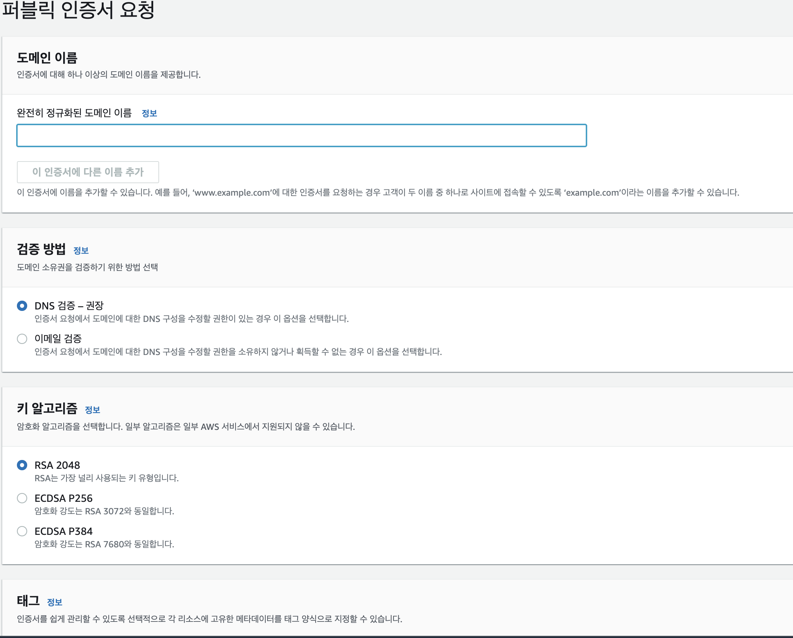
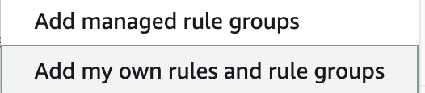

> StoryBook을 S3로 배포하면서 생기었던 문제와 고민되었던 포인트들에 대해서 공유하는 글입니다.

<Callout variant='warn'>

AWS환경으로 배포를 하였습니다.

</Callout>

## github action S3 업로드

> 먼저 저장할 s3를 생성했다는 가정으로 진행하겠습니다.

`S3`접근 권한을 얻기위해 `AWS IAM`을 통해 역할을 생성해줍니다. `IAM Console`에서 생성을 눌러준뒤 `AWS` 서비스를 통해 생성해줍니다.


권한 추가에서는 S3 **fullaccess**를 눌러 추가해준 뒤 완료해줍니다.

만들었던 역할의 `ARN`을 **github secret**에 저장해줍니다

이제 `yml`을 작성해보겠습니다

```yaml
name: StoryBook
run-name: ${{github.actor}} 스토리북 배포

on:
  push:
    branches:
      - develop

jobs:
  storybook:
    runs-on: ubuntu-latest
    outputs:
      status: ${{job.status}}
    permissions:
      id-token: write
      contents: read
    steps:
      - name: checkout repositoty
        uses: actions/checkout@v2
        with:
          fetch-depth: 0

      - name: setup node
        uses: actions/setup-node@v3
        with:
          node-version: 16

      - name: configure aws credentials ARN
        uses: aws-actions/configure-aws-credentials@v4
        with:
          role-to-assume: ${{ secrets.STORYBOOK_ROLE_ARN }}
          aws-region: ap-northeast-2

      - name: cache dependencies
        id: cache
        uses: actions/cache@v3
        with:
          path: '**/node_modules'
          key: ${{ runner.os }}-node-${{ hashFiles('**/package-lock.json') }}-storybook

      - name: install dependencies
        if: steps.cache.outputs.cache-hit != 'true'
        run: npm ci

      - name: build storybook
        run: npm run build-storybook

      - name: bucket sync
        run: |
          aws s3 sync \
          --region ap-northeast-2 \
          ./storybook-static s3://<s3 bucket name> \
          --delete
```

`push`를 하고 기다리다보면 정상적으로 `S3`에 업로드가 됩니다.

이제 정적으로 호스팅을 설정해주겠습니다


생성한 `S3`설정에 들어가 속성탭에 최하단에 보시면 정적 웹 호스팅을 통해 설정을 해줍니다. `storybook` 빌드파일을 보면 **index.html** 기준으로 움직이기 때문에 `index` 문서에 **index.html**을 작성해줍니다.

## 문제 발생

`S3` 정적 호스팅을 위해서 설정을 하다보면 모든 정책을 `Public`으로 정책을 변경하게 되는데 이러면 아무런 제한없이 접근이 가능하다보니 문제가 생기게 됩니다.

1. **버킷이 공개되어있다**
2. **http 통신밖에 하지 못 한다**
3. **버킷 기본 엔드포인트를 사용해야한다**

### 해결방법

이를 해결하기 위해서 **Cloudfront**를 연결하기로 하였습니다.

### HTTPS 인증서 발급받기

먼저 `https`통신을 위해 `SSL`인증서를 발급받아보았습니다.

**AWS Certificate Manager(ATM)** 을 통해 인증서를 요청합니다.

<Callout variant='caution'>

인증서는 반드시 **미국 동부 리전(us-east-1)** 에 있어야합니다

</Callout>


사용할 도메인명을 넣어 완성해줍니다. 그리고 생성한 인증서에 들어가 `Route 53` 레코드 생성하여 등록해줍니다. (저는 회사에서 사용했기에 Route53을 사용했습니다)

### Cloudfront 생성

이번에는 `Cloudfront`를 생성해봅시다

그리고 배포 생성을 눌러 새로운 `Cloudfront`을 만들어봅니다.

원본 도메인에는 만들었던 `S3`를 지정해줍니다.

<Callout variant='warn'>

정적 웹 호스팅이여서 배포하려면 웹 호스팅 주소를 하는게 좋다고하는데 무시하고 s3저장소 선택하시면 됩니다

</Callout>

그리고 원본 액세스란에 **원본 엑세스 제어** 설정을 선택하고

`OAC`가 없다면 옆에 **생성**버튼을 눌러 생성해줍니다


`https`만 하기 위해서 `http`접근시 `https`로 **리다이랙트** 해주기 위해 옵션을 선택해줍니다


SSL인증서에는 방금 발급받았던 **인증서**를 선택해줍니다.

### S3 OAC 적용

원본 액세스제어가 검색했을 때 `OAI`가 많이 나왔는데 AWS를 살펴보니 `OAC`로 변경이 되었고 마이그레이션 방법이 나와있었습니다.

`Cloudfront`를 생성할 때 `OAC`를 사용했기에 `OAC`를 사용했습니다.

<Callout variant='warn' title='legacy'>

OAI : 오리진 액세스 ID

</Callout>
<Callout variant='primary' title='modern'>

OAC: 오리진 엑세스 제어

</Callout>

`OAI`방식으로는 `S3` 버킷 정책에서 다음과 같이 작성을 할 것입니다.

```json
{
  "Version": "2012-10-17",
  "Statement": {
    "Sid": "ExampleStatementID",
    "Effect": "Allow",
    "Principal": {
      "AWS": "arn:aws:iam::cloudfront:user/CloudFront Origin Access Identity <origin access identity ID>"
    },
    "Action": "s3:GetObject",
    "Resource": "arn:aws:s3:::<S3 bucket name>/*"
  }
}
```

`OAC` 방식은 다음과 같이 작성합니다.

```json
{
    "Version": "2008-10-17",
    "Id":"PolicyForCloudFrontPrivateContent",
    "Statement": [
        {
            "Sid": "AllowCloudFrontServicePrincipal",
            "Effect": "Allow",
            "Principal": {
                "Service": "cloudfront.amazonaws.com"
            },
            "Action": "s3:GetObject",
            "Resource": "arn:aws:s3:::<S3 bucket name>/*",
            "Condition": {
                "StringEquals": {
                    "AWS:SourceArn": "arn:aws:cloudfront::<AWS 계정 ID>:distribution/<CloudFront distribution ID>"
                }
						}
         }
			]
},
```

작성 후에 기본 `S3`엔드포인트로 접속해보시면 접근 권한이없다고 메세지가 뜰 것 입니다.

<Callout>

AWS:SourceArn에 들어가는 값은 생성한 Cloudfront에 arn값을 붙여넣으시면 간편합니다

</Callout>

<Callout variant='primary'>

S3는 Cloudfront뒤로 숨길 수 있게 되었고<br/>
이제 S3는 cloudfront에서만 접근이 가능해졌습니다!

</Callout>

### Domain 연결

`cloudfront`의 엔드포인트를 사용하지않고 저는 도메인을 따로 지정해주었습니다.

`Route53`환경에서 레코드 생성에 들어가 레코드 유형을 `CNAME`으로 설정하고 사용할 `subdomain`값을 지정해주고 값으로 cloudfront 엔드포인트를 작성해주시면 됩니다.

## 추가된 고민

배포한 서비스를 외부의 사용자가 접근해도 되는지 였습니다.

개발했던 Storybook에는 디자인 시스템이 적용된 공통 컴포넌트들이였기 때문에 공개가 된다고 하더라도 크게 문제는 발생하지않지만

내부의 자료이고 내용이 계속 추가될 예정이기에 공개하면 안될 것 같았습니다.

회사에서만 접근이 가능하면 좋겠다는 생각이 들었고. 회사에선 똑같은 와이파이를 사용하기에 특정 IP로만 접속을 가능하도록 적용하고 싶었습니다.

### WAF

AWS에서 지원하는 방화벽 서비스이다

`cloudfront` `gateway` `load balancer` 에 적용할 수 있다.

특정 **IP**가 아니라면 블록할 수 있는 기능을 cloudfront앞단에 설치를 해둘 수 있는 것 입니다.

### IP set 만들기

허용할 **IP**를 만들어야하기에 **IP set**에서 새롭게 만들어줍니다

IP의 경우에는

[아이피 확인 - my ip address](https://www.findip.kr/)

여기서 쉽게 알 수 있습니다.

IP set값에 해당 IP를 추가해줍니다

추가적으로 ip뒤에 /32 라는게 붙습니다. 해당 표기는 **CIDR**이라는 표기법으로 비트의 수를 나타냅니다.

32는 특정 네트워크를 가리킬 때 사용하므로 끝에 /32를 붙여주셔야합니다

### Web ACLs

이제 방화벽을 설정해봅시다 cloudfront이기 때문에 global로 두고 새롭게 만들어줍니다


이름을 설정해주고 밑에 적용할 cloudfront를 선택해주고 다음 단계로 넘어갑니다.

이번에는 규칙을 추가해주겠습니다.



**add my own rules and rule groups**를 선택해줍니다


아까 설정한 IP set을 사용하기 위해 IP set을 선택해주고

룰이름과 IPset을 선택해줍니다. action으로는 저희는 허용할 IP를 작성했기에 Allow를 선택하고 다음으로 넘어갑니다


마지막으로 이 부분에 룰에 해당하지 않는 요청은 막아야하기에 Block을 선택해주고 설정을 완료합니다.

다시 접속을 해보면 특정 IP가 아니라면 접속이 불가능합니다.

#### 동일한 IP인데 접속이 되지않는다….

컴퓨터는 잘 되는데 모바일로 들어가보려니 들어가지지않는다

무엇이 다를까 생각해보니 아이폰에서는 추적을 막기위해 IP를 감추고 변경하기 때문이였다.

나는 Icloud 비공개 릴레이도 적용하고 있었다.

비공개 릴레이도 종료하고 사파리에서 되지않기 때문에 설정 → safari → 개인정보 보호 및 보안 에서 IP 주소 가리기 옵션을 꺼주면 정상 접속이 된다!

### 결과

1. **ACM**을 통해서 **https**통신을 하였습니다.
2. S3의 퍼블릭접근을 **OAC**를 통해 Cloudfront뒤로 숨기어 접근하도록하였습니다.
3. s3의 엔드포인트를 사용하지않고 Route53을 사용하여 적절한 도메인값을 할당하여 해결하였습니다
4. **WAF**를 통해 특정 사용자에 대해서만 접근이 가능하도록 하였습니다.
