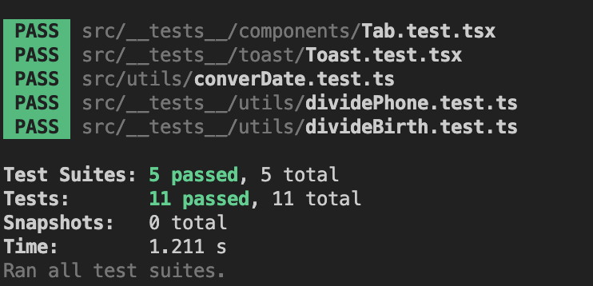

## 테스트 코드의 필요성

서비스를 제작하면서 개발한 부분이 잘 동작하는지 테스트가 필요했습니다.

눈에 보이는 UI작업은 실제로 사용해보면서 테스트도 가능은 하지만

해당 부분이 있는 곳 까지 가서 테스트를 진행해야하고, 일일히 모든 것을 테스트를 해야하기 때문에 자동화가 필요하겠다 느껴져서 jest를 통해서 테스트를 자동화 하기로 하였습니다.

e2e 테스트는 점차 도입하기로 했습니다 (추후 블로그에…)

유닛 테스트의 경우 jest, RTL(react-testing-library)을 이용하기로 하였습니다.

jest의 기본 설정하는 방법은 next.js에 적용방법이 작성되어있습니다.

jest와 RTL에 필요한 라이브러리들을 설치해줍니다

```bash
npm install -D jest jest-environment-jsdom @testing-library/react @testing-library/jest-dom
```

test를 실행시키기 위한 script를 추가해보겠습니다

package.json에 다음 구문을 추가해줍니다

```json
"scripts": {
    ...이전 스크립트
    "test": "jest",
    "test:watch": "jest --watchAll",
    "coverage": "jest --coverage"
  },
```

이제 jest를 설정해주겠습니다.

먼저 jest.config.ts파일을 root위치에 생성해주고 다음과 같이 작성해줍니다

```tsx
import type { Config } from 'jest';
import nextJest from 'next/jest.js';

const createJestConfig = nextJest({
  dir: './',
});

const config: Config = {
  coverageProvider: 'v8',
  testEnvironment: 'jest-environment-jsdom',
  setupFilesAfterEnv: ['<rootDir>/jest.setup.ts'],
  transformIgnorePatterns: ['/node_modules/', '^.+\\.module\\.(css|sass|scss)$'],
  // 절대 경로 사용시
  moduleNameMapper: {
    '^@/(.*)$': '<rootDir>/src/$1',
  },
};

export default createJestConfig(config);
```

이번엔 jest.setup.ts 파일을 생성해준 뒤

```tsx
import '@testing-library/jest-dom';
```

작성해주고 저장해줍니다.

## 테스트코드 작성해보기

toast를 띄울 수 있는 useToast라는 훅을 테스트 해 보겠습니다.

useToast는 normal, warning, info, success 메서드를 제공하여 호출 할 때 title과 description을 넣어 호출하면 toast가 띄워지는 훅입니다.

```tsx
describe('toast test', () => {
  test.each(['normal', 'warning', 'success', 'info'])(
    'toast 테마별로 호출했을 때 메세지가 보여야한다',
    async (kind) => {
      const { result } = renderHook(() => useToast(), {
        wrapper: ClientProvider,
      });
      const spy = jest.spyOn(result.current, kind as 'normal' | 'warning' | 'success' | 'info');
      act(() => {
        result.current[kind as 'normal' | 'warning' | 'success' | 'info']({
          title: `${kind}토스트`,
          description: '입니다',
        });
      });
      expect(screen.getByText(`${kind}토스트`)).toBeInTheDocument();
      expect(spy).toHaveBeenCalled();
    },
  );
});
```

useToast에서 반환하는 모든 매서드를 호출하여 테스트를 진행하기 위해서 `test.each`를 이용해서 손쉽게 반복할 수 있어 매서드 명들을 넣어주었습니다.

RTL에서 hook을 테스트하기 위해서는 `renderHook`이라는 함수를 활용하여 테스트를 할 수 있습니다. useToast에는 Toast를 디자인을 하기 위해 styled-components가 필요했고 디자인 시스템이 적용되어 Provider가 필요했습니다. 그래서 wrapper 옵션으로 ClientProvider을 넣어주어 해결을 하였습니다.

훅 매서드르 호출하고 DOM에 반영하기 위해서 `act`함수로 감싸서 호출해줍니다. 호출이 잘 되었는지 확인을 하기 위해서 jest.spyOn을 이용하여 추적하였습니다.

테스트 시 모든 케이스를 통과했고 Type지정 부분이 아쉬움이 느껴졌습니다. 인자값의 타입은 string으로 들어와 as로 단언를 했어서 깔끔하게 값을 할당하고 싶어 리팩토링을 하게 되었습니다.

useToast는 4개의 매서드를 리턴함으로 리턴에 대한 타입을 작성했습니다

```tsx
type ToastFunction = ReturnType<typeof useToast>;
```

함수의 리턴 타입에 대해서 선언하고 그리고 매서드 명들을 type으로 뽑아 내었습니다

```tsx
type ToastReturnKeys = keyof ToastFunction;
```

타입을 적용하기 위해서는 each문에 제네릭으로 넘겨줘야해서 다음과 같이 작성이 되었습니다

```tsx
test.each<ToastReturnKeys>(['normal', 'warning', 'success', 'info'])(
  'toast 테마별로 호출했을 때 메세지가 보여야한다',
  async (kind) => {
    const { result } = renderHook(() => useToast(), {
      wrapper: ClientProvider,
    });
    const spy = jest.spyOn(result.current, kind);
    act(() => {
      result.current[kind]({
        title: `${kind}토스트`,
        description: '입니다',
      });
    });
    expect(screen.getByText(`${kind}토스트`)).toBeInTheDocument();
    expect(spy).toHaveBeenCalled();
  },
);
```

### typescript로 작성했기에 실행 시 타입 체킹을 할 수가없어 오류가 납니다.

```bash
npm install -D ts-jest @types/jest
```

두 개의 라이브러리를 설치하고 실행하면 잘 동작을 하게 됩니다


